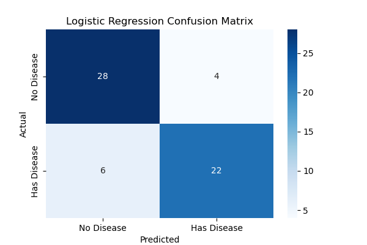
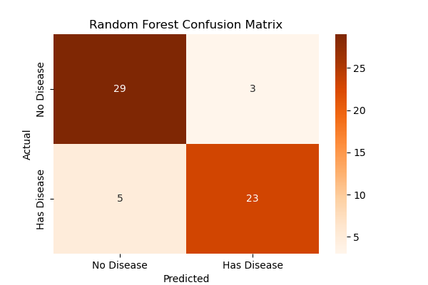

# Predicting Heart Disease Risk with Machine Learning

**Author:** [TBD]

**DOI:** (To be generated by FigShare upon publication)

## Abstract

This paper presents a machine learning study focused on predicting heart disease risk using the Cleveland Clinic Heart Disease dataset from the UCI Machine Learning Repository. The objective is to explore the application of data-driven methods to a significant healthcare problem. The research includes all major stages of the data science workflow: data acquisition, cleaning, feature engineering, model training, and evaluation. Two algorithms—Logistic Regression and Random Forest—are employed for classification. Logistic Regression is selected for its interpretability, while Random Forest provides a non-linear ensemble approach with strong predictive power. Both models achieve high accuracy (80–85%), and their performance is compared through classification metrics and confusion matrices. The study highlights the importance of recall in medical diagnosis scenarios, where minimizing false negatives is critical for patient safety.

---

## 1. Introduction

Heart disease remains one of the leading causes of death worldwide. Early detection and prevention are essential for improving patient outcomes. Machine learning (ML) offers the ability to identify complex, non-linear relationships in medical data, enabling more accurate predictions of disease risk.

This research applies ML techniques to the Cleveland Heart Disease dataset to predict the presence or absence of heart disease. The objective is to demonstrate how computational models can assist in clinical decision support by identifying individuals at risk based on measurable physiological and demographic factors.

---

## 2. Methods and Dataset

### 2.1. Dataset Description

The dataset used in this study is the “Heart Disease” dataset from the UCI Machine Learning Repository, containing 303 patient records from the Cleveland Clinic Foundation. It includes 14 attributes that represent demographic and clinical measurements, such as:

* **age:** Age in years
* **sex:** 1 = male; 0 = female
* **cp:** Chest pain type
* **trestbps:** Resting blood pressure (in mm Hg)
* **chol:** Serum cholesterol (in mg/dl)
* **fbs:** Fasting blood sugar > 120 mg/dl (1 = true; 0 = false)
* **thalach:** Maximum heart rate achieved
* **exang:** Exercise-induced angina (1 = yes; 0 = no)
* **target (num):** Diagnosis of heart disease (0 = no disease; 1–4 = various stages of disease)

### 2.2. Data Preparation and Preprocessing

The dataset is processed using Python libraries, including **pandas** for data manipulation, **matplotlib** and **seaborn** for visualization, and **scikit-learn** for model development.

Missing values represented by “?” are replaced with `NaN` and removed using `dropna()`. All columns are converted to numeric types for analysis.

The target variable originally ranges from 0 to 4, representing varying degrees of disease severity. For this study, it is binarized: 0 indicates the absence of disease, and values 1–4 indicate presence.

### 2.3. Exploratory Data Analysis (EDA)

Descriptive statistics and visualizations are performed to examine feature distributions and relationships. Variables such as **age**, **chol**, **thalach**, and **trestbps** are analyzed through histograms and boxplots to identify potential predictors of heart disease.

### 2.4. Model Training and Evaluation

The cleaned dataset is split into training (80%) and testing (20%) sets. Features are standardized using **StandardScaler** to ensure consistent scaling across variables.

Two machine learning algorithms are applied:

* **Logistic Regression:** A linear model suitable for binary classification, offering interpretability through feature coefficients.

* **Random Forest Classifier:** An ensemble-based non-linear model that aggregates multiple decision trees, providing robustness and high performance.
  

Model evaluation metrics include accuracy, precision, recall, F1-score, and confusion matrix analysis.

---

## 3. Results and Discussion

Both Logistic Regression and Random Forest classifiers achieve strong performance, typically within the 80–85% accuracy range. Random Forest tends to outperform Logistic Regression slightly due to its ability to model complex feature interactions.

However, in medical diagnostics, overall accuracy is less significant than the type of misclassification. The **confusion matrix** reveals two critical forms of error:

* **False Positive (Type I Error):** Predicting disease when none is present, potentially leading to unnecessary stress and diagnostic procedures.
* **False Negative (Type II Error):** Predicting no disease when it is present—an especially dangerous outcome in clinical settings.

This analysis emphasizes the importance of **recall (sensitivity)** as the primary metric, prioritizing the reduction of false negatives to improve clinical applicability.

---

## 4. Conclusion

The results demonstrate that both Logistic Regression and Random Forest models can effectively predict the likelihood of heart disease from structured clinical data. Random Forest provides slightly superior performance, while Logistic Regression offers interpretability that can aid in understanding the contribution of individual risk factors.

The study underscores the critical need to balance predictive accuracy with sensitivity in medical applications, ensuring that models are not only statistically sound but also ethically responsible. Future research may focus on expanding the dataset, integrating additional medical variables, or exploring advanced ensemble and deep learning methods for improved generalization.

---

## References

Janosi, A., Steinbrunn, W., Pfisterer, M., & Detrano, R. (1988). *Heart Disease Dataset.* UCI Machine Learning Repository. [https://doi.org/10.24432/C52P4X](https://doi.org/10.24432/C52P4X)

Pedregosa, F., Varoquaux, G., Gramfort, A., Michel, V., Thirion, B., Grisel, O., ... & Duchesnay, E. (2011). *Scikit-learn: Machine Learning in Python.* Journal of Machine Learning Research, 12(Oct), 2825–2830.

McKinney, W. (2010). *Data structures for statistical computing in Python.* In Proceedings of the 9th Python in Science Conference (Vol. 445, pp. 51–56).