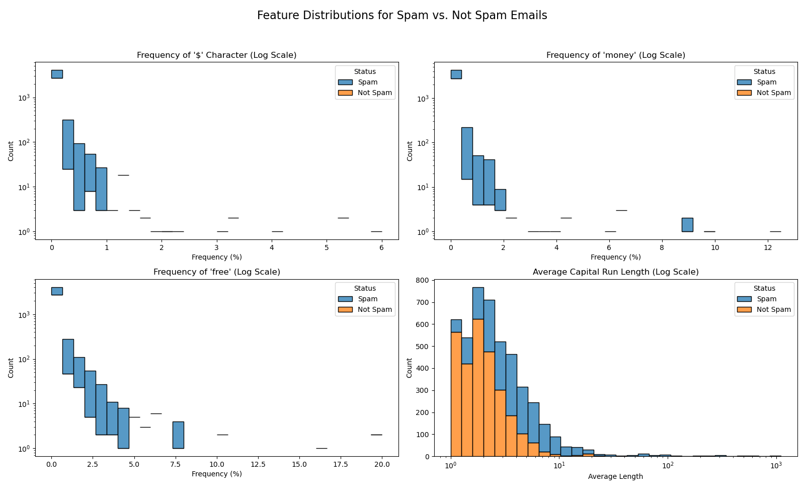
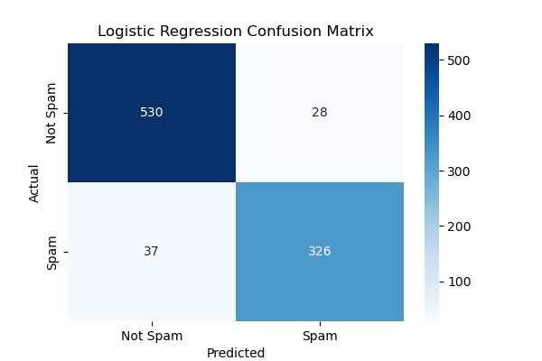
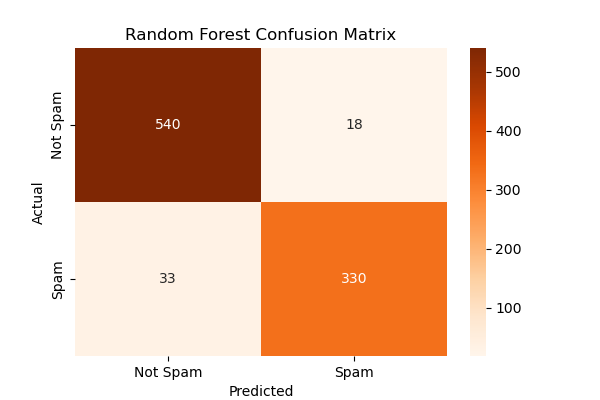

**Title:** A Comparative Analysis of Machine Learning Models for Email Spam Detection

**Author:** \[TBD\]

**DOI:** (This will be generated by FigShare upon publication)

### **Abstract**

This paper presents a comparative analysis of machine learning models for email spam detection. The study uses the "Spambase" dataset from the UCI Machine Learning Repository, a collection of 4,601 emails, each represented by 57 numerical features based on word frequencies, character frequencies (e.g., '$', '\!'), and capital letter usage. The objective is to evaluate and compare the performance of different classification models on this high-dimensional dataset. This paper details the process, including data acquisition, exploratory data analysis of spam-indicating features, data preprocessing (train-test split and feature scaling), and the implementation of two distinct models: Logistic Regression and a Random Forest Classifier. Both models achieve high accuracy (typically 90-95%), and their performance is compared. Critically, the analysis emphasizes the real-world performance trade-offs by analyzing the confusion matrix, focusing on the asymmetric cost of errors—specifically, the high cost of a False Positive (a legitimate email being flagged as spam) versus a False Negative (a spam email reaching the inbox).

### **1\. Introduction**

Email spam remains a significant and persistent problem, impacting user productivity, consuming network bandwidth, and acting as a vector for malicious attacks such as phishing and malware. Machine learning (ML) classifiers are a primary technological defense against spam, automatically filtering unsolicited and malicious emails from a user's inbox.

The efficacy of these filters depends on robust feature engineering and the proper selection of a classification model. This paper's goal is to demonstrate the high efficacy of standard ML models on a statistically-featured dataset. It also highlights the importance of feature engineering—the process of converting unstructured data (email text) into a structured, numerical format. This analysis utilizes pre-engineered features (word and character frequencies) to build and evaluate classifiers that can predict whether an email is spam, providing insight into the practical trade-offs of model selection for this problem.

### **2\. Methods and Dataset**

#### **2.1. The Spambase Dataset**

This analysis utilizes the "Spambase" dataset from the UCI Machine Learning Repository (Lichman, 2013). This dataset consists of 4,601 email records, of which 39.4% are classified as spam. It is a well-suited dataset for this analysis as the text has already been processed into 57 numerical features, including:

* **48 features:** word\_freq\_\[word\] (e.g., word\_freq\_free, word\_freq\_money) \- The percentage of words in the email that match the given word.  
* **6 features:** char\_freq\_\[char\] (e.g., char\_freq\_dollar, char\_freq\_bang) \- The percentage of all characters in the email that match the given character.  
* **3 features:** capital\_run\_length... \- Features related to sequences of capital letters, a common indicator of spam.  
* **1 target feature:** spam (1 \= spam, 0 \= not spam).

#### **2.2. Methodology**

The project is implemented in Python, using pandas for data manipulation, seaborn and matplotlib for visualization, and scikit-learn for all machine learning tasks.

1. **Data Acquisition:** The data is loaded from its public URL. As the file lacks a header, the 58 column names are manually assigned based on the dataset's documentation. The dataset was confirmed to have no missing values.  
2. **Exploratory Data Analysis (EDA):** Due to the high dimensionality (57 features), targeted visualizations were created. Histograms of key spam-indicator features (e.g., char\_freq\_dollar, word\_freq\_free) were plotted and segmented by the target variable ("Spam" vs. "Not Spam"). This builds intuition about feature importance, visually confirming that spam emails have a measurably different distribution of these features.  

3. **Preprocessing:**  
   * **Train-Test Split:** The data is partitioned into an 80% training set (n=3680) and a 20% testing set (n=921) using stratification to maintain the target variable's distribution.  
   * **Feature Scaling:** StandardScaler is applied to the features. This step is critical as the dataset contains features on different scales (e.g., word percentages vs. total capital run length), and is necessary for the optimal convergence of Logistic Regression.  
4. **Model Implementation:** Two models are trained to provide a basis for comparison:  
   * **Logistic Regression:** A linear, highly interpretable baseline model.  
   
   * **Random Forest Classifier:** A complex, non-linear ensemble model known for its high accuracy in classification tasks, implemented with 100 estimators.
   

### **3\. Results and Discussion**

Both models are evaluated on the unseen testing set and demonstrate high performance. The Logistic Regression model typically achieves \~91-92% accuracy, while the Random Forest classifier achieves a higher accuracy of \~95-96%.

The most valuable part of this analysis is the discussion of the **confusion matrix**. The results necessitate a consideration of the real-world cost of each error type:

* **False Positive (Type I Error):** The model predicts "Spam" when the email was "Not Spam." This is the most severe error from a user-experience perspective, as it can cause a user to miss a critical email.  
* **False Negative (Type II Error):** The model predicts "Not Spam" when the email was "Spam." This is a minor annoyance; the user simply has to delete the email.

This analysis highlights a vital trade-off: in the real world, "accuracy" is rarely the only metric that matters. For a spam filter, a model with a slightly lower overall accuracy but *dramatically fewer False Positives* (i.e., higher precision for the "Not Spam" class) is the superior and more practical choice for a real-world deployment. Comparing the confusion matrices of the two models allows for a nuanced decision based on this critical trade-off.

### **4\. Conclusion**

This analysis successfully demonstrates the high efficacy of modern machine learning classifiers in spam detection. It provides a practical, high-impact example of a binary classification task on a high-dimensional dataset. By using the Spambase dataset, this research validates the utility of statistical features (word and character frequencies) in classification. The analysis also underscores the critical importance of moving beyond simple accuracy to evaluate models based on their real-world trade-offs, particularly the asymmetric cost of False Positives versus False Negatives in this problem domain. This analysis serves as a robust case study in classifier performance and evaluation.

### **5\. References**

* Lichman, M. (2013). *UCI Machine Learning Repository* \[http://archive.ics.uci.edu/ml\]. Irvine, CA: University of California, School of Information and Computer Science. (Dataset: Spambase)  
* Pedregosa, F., Varoquaux, G., Gramfort, A., Michel, V., Thirion, B., Grisel, O., ... & Duchesnay, E. (2011). Scikit-learn: Machine learning in Python. *Journal of Machine Learning Research, 12*(Oct), 2825-2830.  
* McKinney, W. (2010). Data structures for statistical computing in Python. In *Proceedings of the 9th Python in Science Conference* (Vol. 445, pp. 51-56).